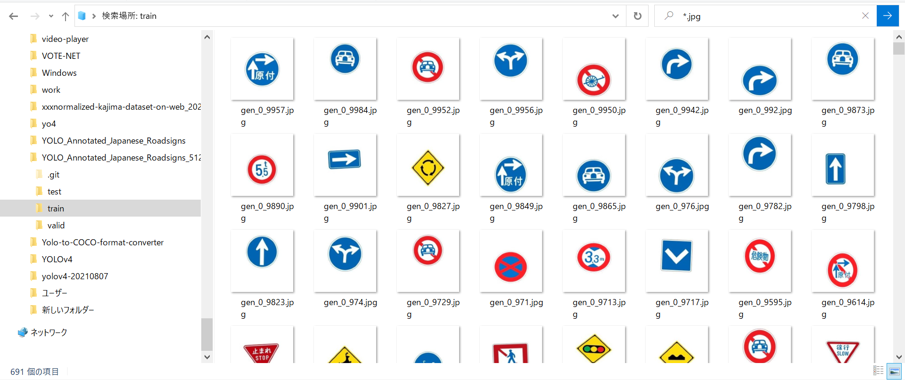
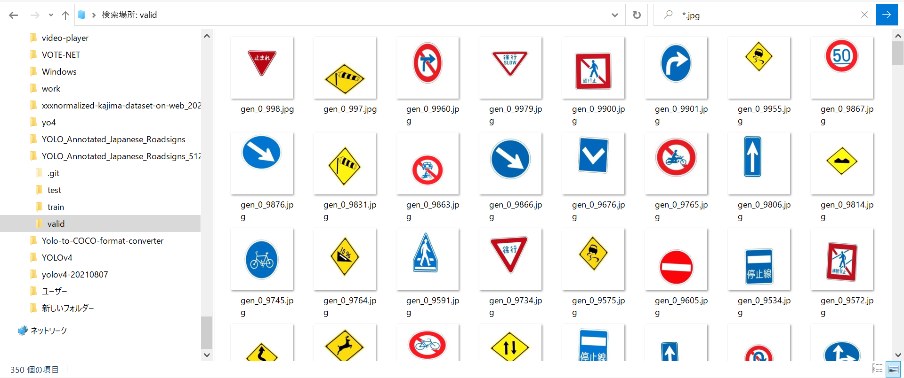

<h2> YOLO_Annotated_Japanese_Roadsigns_512x512</h2>

This is a Japanese roadsigns dataset annotated by YOLO format.
It contains 71 classes,and each image size is 512x512.

 
This dataset is created based on <a href="https://en.wikipedia.org/wiki/Road_signs_in_Japan" >Road signs in Japan</a>.
The master images are augmented by using ImageDataGenerator Tool of Tensorflow-Keras.
 
See also: 
<a href="https://japandriverslicense.com/japanese-road-signs/">Japanese Road Signs</a>
 
<a href="https://english.jaf.or.jp/safe-driving/traffic-rules-in-japan">Driving a Motor Vehicle in Japan</a>
 
 
<a href="http://www.antillia.com/sol4py/samples/keras/AugmentedImagePreview.html">AugmentedImagePreview</a>

 
 
Train folder

 
 
Valid folder

 

 
<b>ClassNames</b>
<pre>
Bicycles_Only
Bumpy_Road
Buses_Priority
Centre_Line
Closed_To_Pedestrians
Crossroads
Dangerous_Wind _Gusts
Directions_Indicator
Falling_Rocks
Keep_Left
Keep_Right
Left_Lane_Ends
Maximum_Height_in_Meters
Maximum_Weight_in_Tons
Maximum_Width_in_Meters
Minimum_Speed_Limit_50km
Motor_Vehicles_Only
No_Bicycles
No_Buses
No_Entry
No_Motorcycles_Or_Mopeds
No_Motor_Vehicles
No_Motor_Vehicles_Except_Motorcycles_And_Mopeds
No_Nonmotorized_Vehicle
No_Overtaking
No_Parking
No_Pedestrian_Crossing
No_Right_Turn_Crossing
No_Stopping
No_Trucks
No_Turns
No_TwoPerson_Motorcycles
No_TwoStage_Right_Turn_For_Mopeds
No_UTurn
No_Vehicles_Carrying_Dangerous_Goods
OneWay
OneWay_To_The_Left
OneWay_To_The_Right
Other_Dangers
Pedestrians_Only
Pedestrian_Crossing
RailroadCrossing
Roadworks
Road_Closed_To_Pedestrian
Road_Closed_To_Vehicles
Road_Narrows
Rotary
Roundabout
Safety_Zone
School_Crossing
School_Zone
Slippery_Surface
Slow_Down
Sound_Horn
Speed_Limit_90km
Steep_Ascent_10%
Steep_Descent_10%
Stop
Stop_Line
Straight_Ahead_Or_Left_Turn
Straight_Ahead_Or_Right_Turn
Succession_Of_More_Than_Two_Curves_To_The_Right
Traffic_Lights_Ahead
Traffic_Merges_From_Left
Turn_Left
Turn_Left_Or_Right
Turn_Right
TwoStage_Right_Turn_For_Mopeds
TwoWay_Traffic_Ahead
Wild_Animals_Crossing
Traffic_Circle
</pre>

